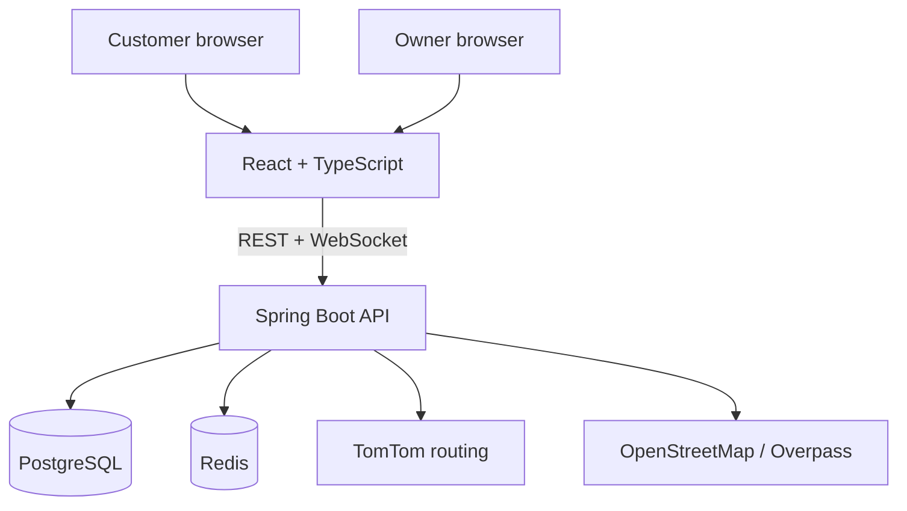

# NowServing

NowServing is a real-time virtual queue and reservation platform I built around a simple problem: knowing that you're third in line isn't very useful if you still don't know when to leave home.

Customers can join a line remotely, follow their position as it moves, and optionally share their location to get a traffic-aware "leave now" recommendation. Restaurant staff run the line from a dashboard that updates as customers join, arrive, and get served.

> **Demo:** [Watch the demo](https://youtu.be/bfoX0gh2HCs)

---

## Why I built it

I've spent a lot of time standing outside restaurants after giving my name to a host, with no idea whether the wait was ten minutes or forty. Same story at barbershops and walk-in clinics. The annoying part was never the wait itself — it was not being able to plan around it. You can't go do something else, because you might miss your turn.

Most waitlist products stop at "you're #3." That's a status, not an answer. The question people actually have is "when should I leave?", and answering it means knowing two things at once: how fast the line is moving, and how long it takes to get there.

That's the problem this project is built around.

## What it does

There are two sides. Customers never make an account — the link or QR code is the credential. Owners sign in and manage their lines.

### Customer flow

- **Find somewhere nearby.** Discovery merges restaurants using NowServing with OpenStreetMap results, so the map isn't empty in a city where nobody has signed up. Places that aren't on NowServing never show a "Join" button they can't honour.
- **Pick a restaurant.** Live wait estimate and how many parties are ahead.
- **Join without an account.** Name and party size. That's the whole form.
- **Watch your ticket.** Position updates live, no refresh.
- **Share location (optional).** Everything works without it; you just don't get travel advice.
- **Leave Now.** The part I care most about — see below.
- **"I'm on my way."** Tells the restaurant you're coming so they can hold your spot.
- **Reserve a table** instead of waiting, when the restaurant has bookings turned on.
- **Scan the restaurant's QR code** to jump straight to any of the above.

### Owner experience

- Create and manage queues (a restaurant can run more than one — walk-ins and dinner service, say)
- See who's waiting, party sizes, and how long they've waited
- **Next** to serve the front of the line, **No-show** to remove someone
- See at a glance who's already **en route**
- **Open / Close** a queue for the night
- **Publish / Hide** the restaurant from public discovery — separate from open/closed
- Set the restaurant's location, control how far away people may join from
- Configure reservations: opening hours, slot length, covers per slot
- A permanent restaurant QR code, plus settings to rename or delete the business

## Leave Now

This is the feature the rest of the project exists to support.

Instead of only telling someone their position, NowServing works out roughly **when they should set off**:

```
leave at  =  when your turn is expected
           −  how long it takes to get there
           −  a small safety buffer
```

The first number comes from the queue itself — how many parties are ahead, how many stations the venue runs, and how quickly it has actually been serving people (measured, not assumed). The second comes from TomTom's routing API, so it reflects current traffic rather than a straight-line guess.

Two deliberate choices here:

**It degrades instead of lying.** If TomTom is unavailable, the app falls back to a distance-based estimate and *says* it's a rough estimate rather than passing it off as traffic-aware.

**It's a window, not a promise.** Wait times are shown as a range ("25–35 min"), because a single number reads as a commitment the restaurant hasn't made.

## Real-time behavior

Customer and owner screens stay in sync over WebSockets (STOMP). When a staff member taps Next, every customer's position updates without a refresh, and the dashboard reflects a new customer joining the moment it happens.

A WebSocket connection is pinned to one server process, which breaks the moment you run more than one instance: the customer's phone might be attached to instance A while the tablet that tapped Next is talking to instance B. Redis Pub/Sub carries the event between instances so every socket hears about it. Polling stays in place as a fallback, so a dropped socket degrades to a slower update rather than a stuck screen.

## Reliability

A queue is a small system with a surprising number of ways to go wrong. The parts that took the most thought:

- **Two staff tapping "Next" at the same time.** The obvious implementation — read the front entry, then mark it served — has a gap between the read and the write where both requests pick the same person. Advancing the line uses `SELECT … FOR UPDATE SKIP LOCKED`, so concurrent taps lock different rows and serve different people.
- **Duplicate submissions.** Joining and booking accept an idempotency key, so a double-tap or a retry on bad signal returns the original ticket instead of taking a second place in line.
- **Stale tickets.** A ticket saved in the browser isn't proof it's still live. The app confirms with the server and clears tickets that have been served or abandoned, rather than showing someone a place in a line they already left.
- **Third-party APIs failing.** TomTom and Overpass are both treated as things that will be down sometimes. Responses are cached, failures fall back to something honest, and a circuit breaker stops a slow dependency from becoming an app-wide outage.
- **Customer and owner disagreeing.** The two sides read the same data through the same queries, so a count on one screen can't drift from a list on the other.

## Tech stack

**Backend** — Java 21, Spring Boot, PostgreSQL, Redis, Flyway
**Frontend** — React, TypeScript, Vite
**Real-time** — WebSockets (STOMP) with Redis Pub/Sub for cross-instance fan-out
**External** — TomTom (routing and traffic), OpenStreetMap via Overpass (nearby places)
**Testing** — JUnit with Testcontainers, running against real Postgres and Redis. 137 backend tests currently pass.

## Architecture



The backend is a fairly ordinary layered Spring application — controllers, services, JPA repositories — with two things worth pointing out.

External integrations sit behind interfaces (`TravelTimeProvider`, `PlacesProvider`, `NotificationChannel`, `SmsSender`). Tests use real in-process fakes rather than mocking frameworks, which means the tests exercise actual behaviour and a provider can be swapped without touching the services that use it.

Tenant isolation is enforced by query shape, not by an `if` statement. Owner-scoped lookups take the business ID from the signed JWT and query `findByIdAndBusinessId(...)`, so another tenant's row simply isn't found. There is no endpoint that accepts a business ID from the client.

More detail in [docs/ARCHITECTURE.md](docs/ARCHITECTURE.md).

## Project structure

```
backend/    Spring Boot API, Flyway migrations, tests, demo seed script
frontend/   React + TypeScript client (Vite)
docs/       Architecture notes, deployment, OAuth and push setup
```

## Running locally

You'll need Java 21, Node 20+, and Docker.

**1. Start Postgres and Redis**

```bash
cd backend
docker compose up -d
```

Postgres comes up on host port **5433** and Redis on **6380** (both offset from the defaults so they don't collide with other local projects). Flyway applies the migrations on first boot.

**2. Backend**

```bash
cd backend
./gradlew bootRun
```

Runs on **http://localhost:8080**.

**3. Frontend**

```bash
cd frontend
npm install
npm run dev
```

Runs on **http://localhost:5173**.

**4. Demo data (optional)**

```bash
cd backend
./scripts/demo-seed.sh
```

Sets up a restaurant with two queues, a few waiting customers, and reservations enabled. Re-running it resets to the same state, which is handy when you've been clicking around.

The app is usable at this point. Sign up as an owner at `/owner/signup`, create a queue, and open its join link in another window as a customer.

## Environment setup

Everything below is optional — the core queue and reservation flows work without any of it. Missing keys disable the feature they belong to and say so in the log rather than failing quietly.

**Backend** — copy `backend/config/application-example.properties` to `backend/config/application.properties` (that path is gitignored) or set these as environment variables:

| Variable | What it's for |
|---|---|
| `TOMTOM_API_KEY` | Traffic-aware travel times. Without it, Leave Now falls back to a distance estimate and labels it as rough. |
| `VAPID_PUBLIC_KEY` / `VAPID_PRIVATE_KEY` | Web Push. Without them the ticket page tells the customer push is unavailable instead of offering a button that can't deliver. |
| `TWILIO_ACCOUNT_SID` / `TWILIO_AUTH_TOKEN` / `TWILIO_FROM_NUMBER` | SMS fallback. Absent by default; the UI hides the SMS option when the server has no credentials. |
| `JWT_SECRET` | Signing key for owner sessions. Ships with an obvious dev-only default — **set this to something random before deploying anywhere real.** |
| `DB_URL` / `DB_USERNAME` / `DB_PASSWORD` | Default to the local docker-compose values. |
| `GOOGLE_CLIENT_ID` | Google sign-in. This is a browser-facing client ID, not a secret — there's no client secret in this project, because sign-in uses the ID-token flow. See [docs/GOOGLE_OAUTH_SETUP.md](docs/GOOGLE_OAUTH_SETUP.md). |

**Frontend** — copy `frontend/.env.example` to `frontend/.env`. Both values are compiled into the browser bundle, so neither is secret.

## Screenshots

_To be added._

| | |
|---|---|
| Customer ticket with Leave Now | _screenshot_ |
| Owner queue dashboard | _screenshot_ |
| Nearby discovery | _screenshot_ |

## Testing

```bash
cd backend && ./gradlew test        # integration tests against real Postgres + Redis
cd frontend && npm run build        # typecheck + production build
cd frontend && npm run lint         # oxlint
```

Most of the backend tests are integration tests using Testcontainers rather than unit tests with mocks. They're slower, but they catch the things that actually broke during development — transaction boundaries, concurrent queue advancement, tenant isolation — which mocked tests would have happily passed.

## What I learned

**Real-time is a state problem, not a WebSocket problem.** Getting messages to the browser was the easy part. The hard part was making sure the customer's screen and the owner's screen never disagreed, especially around reconnects and terminal states.

**Concurrency shows up in boring places.** "Serve the next customer" looks like a one-liner until two tablets do it simultaneously.

**Third-party failure isn't an edge case.** Treating TomTom and Overpass as things that are sometimes down changed the design: caching, fallbacks, and being honest in the UI about which number you're looking at.

**Product rules and backend rules have to agree.** A queue being *closed* and a restaurant being *hidden* are different things, and conflating them produced bugs that only showed up as confusing UI.

## Future improvements

A few things are genuinely not finished, and I'd rather say so than imply otherwise:

- **Browser push is only verified server-side.** The backend sends a correctly encrypted push to the subscription endpoint; I haven't verified the notification rendering on a real device end-to-end.
- **SMS has never been sent through a live provider.** The Twilio adapter is written and the UI hides the option when credentials are absent, but no real message has gone out.
- **Reservation departure reminders don't exist yet.** Leave Now is driven by queue position; the same idea applied to a booked time slot is the obvious next step.
- **No browser E2E suite.** Testing has been backend integration tests plus manual verification in a real browser.
- Rate limiting is per-instance and in-memory, which is fine for one node and would need Redis behind a load balancer.
