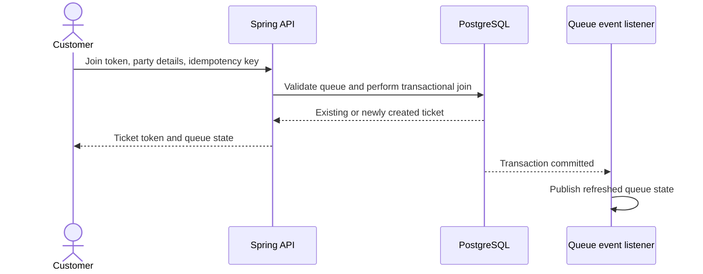
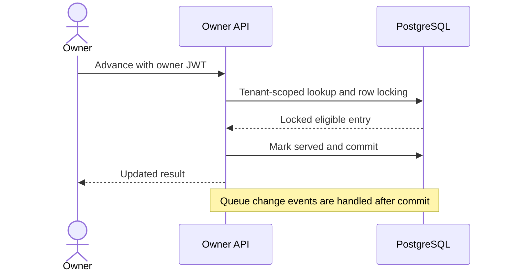
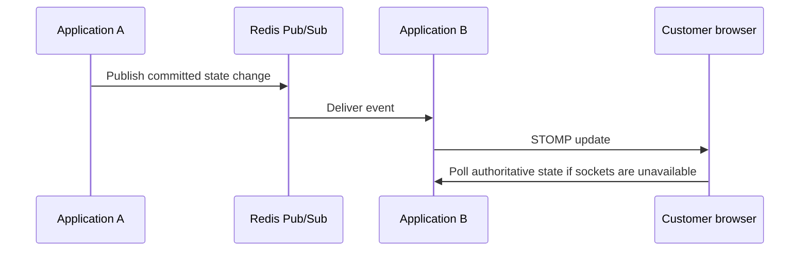
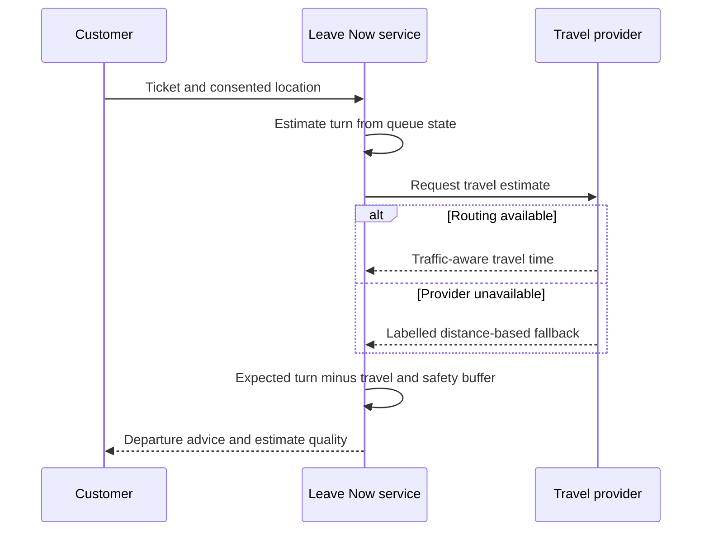

# Core flows

These diagrams summarize the implementation. They do not imply exactly-once event delivery or measured performance.

## Joining a queue

## Advancing a queue

## Cross-instance updates

Redis distributes transient notifications; PostgreSQL remains the durable source of truth. Polling repairs missed updates rather than relying on replay from Pub/Sub.

## Leave Now

